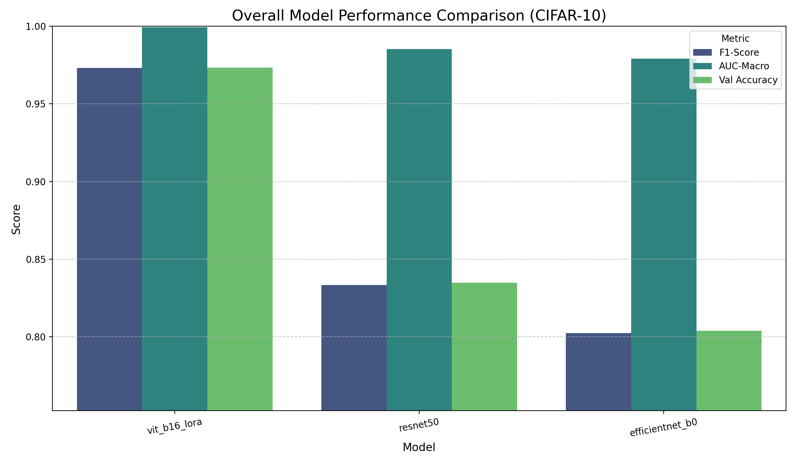

# An Empirical Investigation into Fine-Tuning Methodologies: ViT-LoRA vs. CNNs

This repository contains the official PyTorch implementation for the paper: **"An Empirical Investigation into Fine-Tuning Methodologies: A Comparative Benchmark of LoRA for Vision Transformers against Traditional Classifier-Only CNN Fine-Tuning."**

This work conducts a detailed performance and efficiency analysis of two popular fine-tuning strategies on standard computer vision datasets.

---

## Overview

The core of this project is a comparative benchmark between two distinct model adaptation philosophies:

1.  **Parameter-Efficient Fine-Tuning (PEFT):** Using Low-Rank Adaptation (LoRA) on a pre-trained Vision Transformer (ViT-B/16).
2.  **Traditional Fine-Tuning:** Training only the final classifier head of pre-trained Convolutional Neural Networks (ResNet50 and EfficientNet-B0).

We evaluate these methods across three standard datasets—**MNIST**, **Fashion-MNIST**, and **CIFAR-10**—to understand how performance and efficiency vary with task complexity.

*
Performance comparison on the most complex dataset, CIFAR-10, highlighting the significant advantage of the ViT-LoRA approach.
*

---

## Key Features

- **LoRA for Vision:** A clean implementation of Low-Rank Adaptation for Vision Transformers.
- **Comparative Analysis:** Code to benchmark three powerful models (ViT-B/16, ResNet50, EfficientNet-B0).
- **Three Standard Datasets:** Easily run benchmarks on MNIST, Fashion-MNIST, and CIFAR-10.
- **Detailed Evaluation:** Generates comprehensive evaluation metrics, including accuracy, F1-scores, AUC, confusion matrices, and learning curves.
- **Reproducibility:** All scripts are self-contained and designed for easy reproduction of the paper's results.

---

## Methodology

### Models

- **`ViT-B/16-LoRA`**: A Vision Transformer (Base, 16x16 patches) where the original weights are frozen. LoRA matrices (rank=16) are injected into the self-attention mechanism's query and value projection layers for efficient fine-tuning.
- **`ResNet50`**: A 50-layer Residual Network. The convolutional backbone is frozen, and only a new, randomly initialized final classifier head is trained.
- **`EfficientNet-B0`**: The baseline EfficientNet model. The fine-tuning strategy is the same as for ResNet50, with only the final classifier being trained.

### Datasets

| Dataset       | Description                            | Classes | Size        | Channels  |
|---------------|----------------------------------------|---------|-------------|-----------|
| **MNIST** | Handwritten Digits                     | 10      | 28x28       | Grayscale |
| **Fashion-MNIST** | Articles of Clothing                   | 10      | 28x28       | Grayscale |
| **CIFAR-10** | Objects (Airplanes, Dogs, Cats, etc.) | 10      | 32x32       | Color (RGB) |

*Note: All images are resized to 224x224 and converted to 3-channel RGB to be compatible with the pre-trained models.*

---
